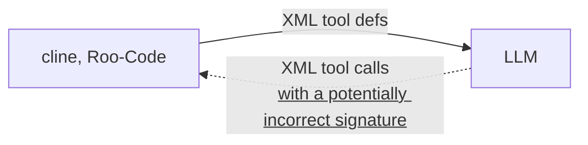
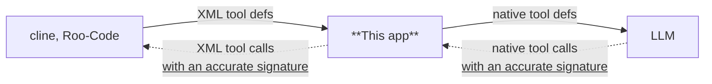

# NativeToolCallAdapter
[日本語](README.ja-JP.md) | [English](README.md)

## 概要

- BEFORE (without this app)


- AFTER (with this app)


比較的小さなモデルでは、[cline](https://github.com/cline/cline)や[Roo-Code](https://github.com/RooCodeInc/Roo-Code)のツール呼び出しの処理が上手く扱えないことがあります。
このアプリケーションはClineやRoo-CodeのXML形式のツール呼び出しをパースし、OpenAI APIのtool_callsに準じた形式に変換します。

[gpt-oss-20b](https://huggingface.co/openai/gpt-oss-20b)などで挙動が大幅に改善することが確認できています。
大きなモデルであってもツール呼び出しを考える負荷が減るため、より正確な挙動になると思われます。


## 注意事項
あくまでも実験的なアプリケーションです。
パース処理はCline/Roo-Codeのプロンプトの内容に依存しているため、将来的なプロンプトの仕様変更で動かなくなる可能性があります。


## 実行手順
1. `git clone https://github.com/irreg/native_tool_call_adapter.git
2. `uv sync`
3. `set TARGET_BASE_URL=実際のLLMが動作しているURL`  
   例:
   - TARGET_BASE_URL: http://localhost:8080/v1
4. `uv run main.py`
5. port 8000でサーバーが起動するので、Cline, Roo-Codeを設定してください。  
   例: 
   - API プロバイダー: OpenAI Compatible
   - Base URL: http://localhost:8000/v1
   - APIキー: APIキーを設定すると、TARGET_BASE_URLと通信するときに自動的に使用します。


## 設定
下記の設定を環境変数として設定可能です
- TARGET_BASE_URL: (default: https://api.openai.com/v1) LLMをホスティングしているURL
- TOOL_CALL_ADAPTER_HOST: (default: 0.0.0.0) このアプリをホストするURL
- TOOL_CALL_ADAPTER_PORT: (default: 8000) このアプリをホストするポート
- MESSAGE_DUMP_PATH: (default: null) 指定したパスに実際にLLMに送られるメッセージをダンプするので、変換後の内容を確認出来ます  

setting.jsonに正規表現を登録すると、追加で置換することが出来ます  
システムプロンプト(`system`)と、roo-codeの自動応答(`user`)に含まれる"XML format"を"native format"に置換する例:
```json
{
  "additional_replacement": {
    "system": { "XML format": "native format"},
    "user": { "XML format": "native format"}
  }
}
```