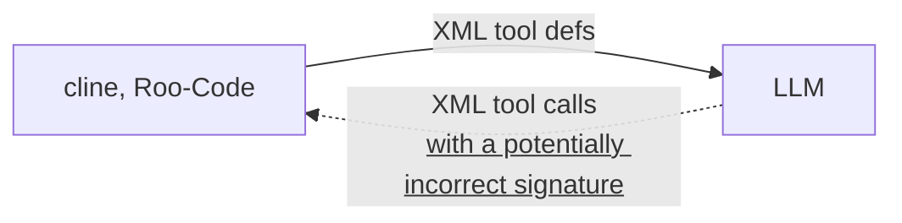
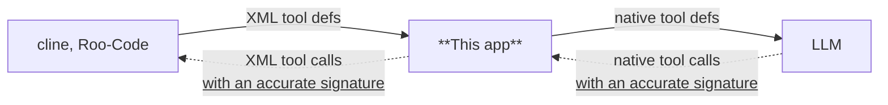

# NativeToolCallAdapter
[日本語](README.ja-JP.md) | [English](README.md)

## 概要

- BEFORE (without this app)


- AFTER (with this app)


比較的小さなモデルでは、[cline](https://github.com/cline/cline)や[Roo-Code](https://github.com/RooCodeInc/Roo-Code)のツール呼び出しの処理が上手く扱えないことがあります。
このアプリケーションはClineやRoo-CodeのXML形式のツール呼び出しをパースし、OpenAI APIのtool_callsに準じた形式に変換します。

[gpt-oss-20b](https://huggingface.co/openai/gpt-oss-20b)などで挙動が大幅に改善することが確認できています。
大きなモデルであってもツール呼び出しを考える負荷が減るため、より正確な挙動になると思われます。


## 注意事項
あくまでも実験的なアプリケーションです。
パース処理はCline/Roo-Codeのプロンプトの内容に依存しているため、将来的なプロンプトの仕様変更で動かなくなる可能性があります。


## 実行手順
1. `git clone https://github.com/irreg/native_tool_call_adapter.git
2. `uv sync`
3. `set TARGET_BASE_URL=実際のLLMが動作しているURL`  
   例:
   - TARGET_BASE_URL: http://localhost:8080/v1
4. `uv run main.py`
5. port 8000でサーバーが起動するので、Cline, Roo-Codeを設定してください。  
   例: 
   - API プロバイダー: OpenAI Compatible
   - Base URL: http://localhost:8000/v1
   - APIキー: APIキーを設定すると、TARGET_BASE_URLと通信するときに自動的に使用します。


## 設定
下記の設定を環境変数として設定可能です
- TARGET_BASE_URL: (default: https://api.openai.com/v1) LLMをホスティングしているURL
- TOOL_CALL_ADAPTER_HOST: (default: 0.0.0.0) このアプリをホストするURL
- TOOL_CALL_ADAPTER_PORT: (default: 8000) このアプリをホストするポート
- MESSAGE_DUMP_PATH: (default: null) 指定したパスに実際にLLMに送られるメッセージをダンプするので、変換後の内容を確認出来ます  
- TOOL_DUMP_PATH: (default: null) 指定したパスに実際にLLMに送られるツール定義一覧をダンプするので、変換後の内容を確認出来ます  
- DISABLE_STRICT_SCHEMAS: (default: null) ツール定義に一致しないツール呼び出しを防ぐ機能を無効化します。  
    複雑過ぎる定義を持つツールではツール呼び出しが不安定になることがあります。そのような症状が出た場合は、1を設定して無効化してください。
- FORCE_TOOL_CALLING: (default: null) 必ずツールをどれか呼び出すように強制します。  
    llama.cppでは、これを有効化するとreasoningが無効化されることがある(おそらくllama.cppのバグ)ため、デフォルトでは無効になっています。  
    症状が発生しない場合や、reasoningが不要な場合は1を設定して有効化してください。cline/Roo-Codeにおいて、ツール呼び出し失敗を発生しにくくすることが出来ます。


### setting.yaml
setting.yaml に正規表現による追加の置換ルールを定義できます。  
既存のjson版の設定(deprecated)を利用する場合はyamlファイルを削除してください。

#### 設定ファイルの構造
```yaml
additional_replacement:
  - name: 置換ルールの名前
    role: 対象となるロール
    pattern: 正規表現パターン
    replace: 置換後の文字列
    trigger: 置換を有効化する条件キー
    ref: 参照する role 名のリスト
```
各フィールドの説明
- name: (任意)この置換ルールの名称
- role: このルールが適用されるメッセージの role
	- system: システムプロンプト
	- user: ユーザの入力したメッセージ または cline/Roo-CodeがLLMに対して応答したメッセージ(ツール呼び出しに失敗した場合など)
	- tool: 過去のツール呼び出し結果
	- assistant: ツール呼び出し以外の部分の過去のLLMの応答
	- completion: LLMが新しく生成した応答(cline/Roo-Codeに返す、ツール呼び出しを含むデータ)
- pattern: 検索する正規表現パターン。
- replace: (任意)置換後の文字列。  
	省略した場合、patternに含まれる名前付きキャプチャグループ(例: `(?P<key>...)`)にマッチした文字列をキャプチャして、次に処理するpattern/replace内で利用することが出来ます。
- ref: (任意)指定のroleの直前に処理したメッセージからキャプチャした文字列をpattern/replaceで使用します。pattern/replace内にある`{key}`の形式の文字列をキャプチャした文字列で置換します。
- trigger: (任意)直前に処理したpatternからキャプチャした文字列にkeyの名前付きキャプチャグループが含まれている場合のみ置換を実行します。

例1: clineからLLMへの応答に含まれるXML tagsの文字列をtool callingに置き換える
```yaml
additional_replacement:
  - role: user
    pattern: XML tags
    replace: tool calling
```

例2: ユーザのメッセージから user_id を抽出し、LLMの出力に対してその値を使って置換を行う
```yaml
additional_replacement:
  - role: user
    pattern: ID:(?P<user_id>\d+)
  - role: completion
    trigger: user_id
    ref: [user]
    pattern: Hello
    replace: Hello #{user_id}!
```