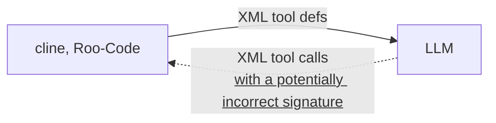
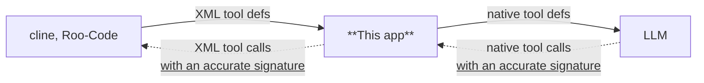

# NativeToolCallAdapter
[日本語](README.ja-JP.md) | [English](README.md)


## Overview

- BEFORE (without this app)


- AFTER (with this app)


With relatively small models, [cline](https://github.com/cline/cline) and [Roo-Code](https://github.com/RooCodeInc/Roo-Code) tool calls may not be handled properly.
This application parses XML-formatted tool calls from Cline and Roo-Code and converts them into a format compliant with OpenAI API's tool_calls.

Significant improvements in performance have been confirmed with [gpt-oss-20b](https://huggingface.co/openai/gpt-oss-20b) and other models.
Even with large models, the reduced load of considering tool calls should lead to more accurate behavior.


## Notes
This is an experimental application.
Parsing depends on the content of Cline/Roo-Code prompts, so it may stop working if the prompt specifications change in the future.


## Execution Steps

1. `git clone https://github.com/irreg/native_tool_call_adapter.git
2. `uv sync`
3. `set TARGET_BASE_URL=actual LLM operating URL`  
   Example:
   - TARGET_BASE_URL: http://localhost:8080/v1
4. `uv run main.py`
5. The server will start on port 8000, so configure Cline and Roo-Code.  
   Example:
   - API Provider: OpenAI Compatible
   - Base URL: http://localhost:8000/v1
   - API Key: Setting the API key will automatically use it when communicating with TARGET_BASE_URL.


## Settings
The following settings can be configured as environment variables
- TARGET_BASE_URL: (default: https://api.openai.com/v1) URL hosting the LLM
- TOOL_CALL_ADAPTER_HOST: (default: 0.0.0.0) URL hosting this application
- TOOL_CALL_ADAPTER_PORT: (default: 8000) Port hosting this application
- MESSAGE_DUMP_PATH: (default: null) Dumps the message actually sent to the LLM to the specified path, allowing you to verify the converted content  

Registering regular expressions in `setting.json` enables additional replacements.  
Example of replacing "XML format" with "native format" in system prompt(`system`) and roo-code auto-responses(`user`):
```json
{
  "additional_replacement": {
    "system": { "XML format": "native format"},
    "user": { "XML format": "native format"}
  }
}
```