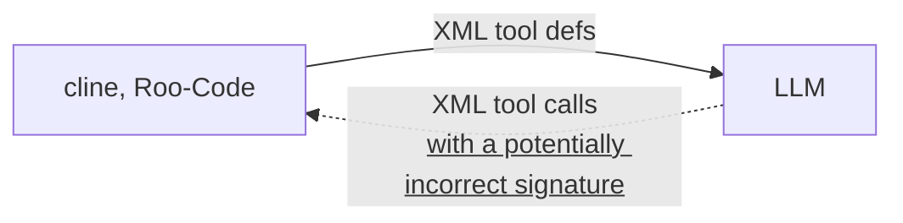
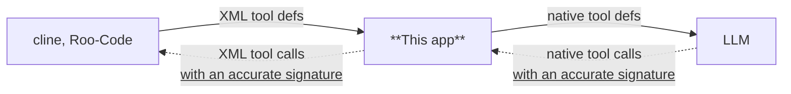

# NativeToolCallAdapter

## Overview

- BEFORE (without this app)

- AFTER (with this app)

With relatively small models, [cline](https://github.com/cline/cline) and [Roo-Code](https://github.com/RooCodeInc/Roo-Code) tool calls may not be handled properly.
This application parses XML-formatted tool calls from Cline and Roo-Code and converts them into a format compliant with OpenAI API's tool_calls.

Significant improvements in performance have been confirmed with [gpt-oss-20b](https://huggingface.co/openai/gpt-oss-20b) and other models.

比較的小さなモデルでは、[cline](https://github.com/cline/cline)や[Roo-Code](https://github.com/RooCodeInc/Roo-Code)のツール呼び出しの処理が上手く扱えないことがあります。
このアプリケーションはClineやRoo-CodeのXML形式のツール呼び出しをパースし、OpenAI APIのtool_callsに準じた形式に変換します。

[gpt-oss-20b](https://huggingface.co/openai/gpt-oss-20b)などで挙動が大幅に改善することが確認できています。

## Notes
This is an experimental application.
Parsing depends on the content of Cline/Roo-Code prompts, so it may stop working if the prompt specifications change in the future.

あくまでも実験的なアプリケーションです。
パース処理はCline/Roo-Codeのプロンプトの内容に依存しているため、将来的なプロンプトの仕様変更で動かなくなる可能性があります。

## Execution Steps

1. `git clone https://github.com/irreg/native_tool_call_adapter.git
2. `uv sync`
3. `set TARGET_BASE_URL=actual LLM operating URL`  
   Example:
   - TARGET_BASE_URL: http://localhost:8080/v1
4. `uv run main.py`
5. The server will start on port 8000, so configure Cline and Roo-Code.  
   Example:
   - API Provider: OpenAI Compatible
   - Base URL: http://localhost:8000/v1
   - API Key: Setting the API key will automatically use it when communicating with TARGET_BASE_URL.

## 実行手順
1. `git clone https://github.com/irreg/native_tool_call_adapter.git
2. `uv sync`
3. `set TARGET_BASE_URL=実際のLLMが動作しているURL`  
   例:
   - TARGET_BASE_URL: http://localhost:8080/v1
4. `uv run main.py`
5. port 8000でサーバーが起動するので、Cline, Roo-Codeを設定してください。  
   例: 
   - API プロバイダー: OpenAI Compatible
   - Base URL: http://localhost:8000/v1
   - APIキー: APIキーを設定すると、TARGET_BASE_URLと通信するときに自動的に使用します。

## Settings
The following settings can be configured as environment variables
TARGET_BASE_URL: (default: https://api.openai.com/v1) URL hosting the LLM
TOOL_CALL_ADAPTER_HOST: (default: 0.0.0.0) URL hosting this application
TOOL_CALL_ADAPTER_PORT: (default: 8000) Port hosting this application

下記の設定を環境変数として設定可能です
TARGET_BASE_URL: (default: https://api.openai.com/v1) LLMをホスティングしているURL
TOOL_CALL_ADAPTER_HOST: (default: 0.0.0.0) このアプリをホストするURL
TOOL_CALL_ADAPTER_PORT: (default: 8000) このアプリをホストするポート
